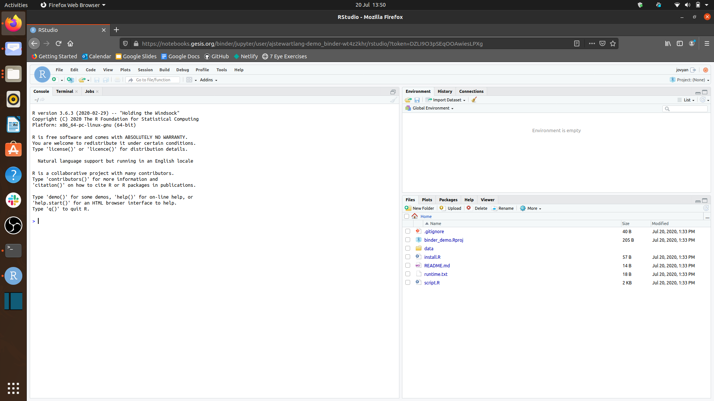

# Overview

In this workshop we will expore how to set up a [Binder](https://mybinder.readthedocs.io/en/latest/#) for one of our R projects. Binder allows you to capture your data, code, and computational environment in a way that it can be easily shared with others that makes your research fully reproducible. After watching the following video, you will be able to create your own Binder for your R analyses.

&nbsp;&nbsp;

<iframe width="560" height="315" src="https://youtube.com/embed/6mjqOuMTtz4" frameborder="0" allowfullscreen></iframe>

&nbsp;&nbsp;

## Slides

You can download the slides in .odp format by clicking [here](../slides/23_introduction_to_binder.odp) and in .pdf format by clicking on the image below. 

&nbsp;&nbsp;

[{width=75%}](../slides/23_introduction_to_binder.pdf)

&nbsp;&nbsp;

If you'd like to launch the Binder I created in the video, you can click on the image below.

&nbsp;&nbsp;

&nbsp;&nbsp;

# Your Challenge

Using one of the R scripts you have written previously in this unit, I would like you to Binderise it following the steps in the video. Slide 12 onwards will take you through the stages you need to complete which will result in a weblink for your R analysis that you can then share with others.

## Improve this Workshop

If you spot any issues/errors in this workshop, you can raise an issue or create a pull request for [this repo](https://github.com/ajstewartlang/23_introduction_to_binder).

